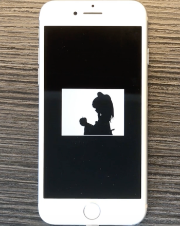

# bad_apple module

This is a simple pongoOS module for playing animated GIFs in pongoOS. The code does work but since it uses GIFs, compiled modules can be really big. For example, generating a module from a ~2 MB mp4 results in a module that is about 54 MBs in size.

Photo of an iPhone 7 displaying Bad Apple running on pongoOS:

The full video can be found [on Reddit](https://www.reddit.com/r/jailbreak/comments/kzt4ks).

## Building

1. If you want to, create your own data files with `convert.sh`. If you skip this step, Bad Apple data from the `bad-apple` folder will be used instead.
2. Make sure you cloned pongoOS to `../pongoOS` and compiled it.
3. Connect your iDevice with pongoOS booted up.
4. Run `make badapple.bin test`.

## Files

### `./convert.sh <gif>`

You can use this script to generate your own data files.

### `bad-apple`

This folder contains data for the Bad Apple video. See the [README.md file](bad-apple/README.md) for more information.